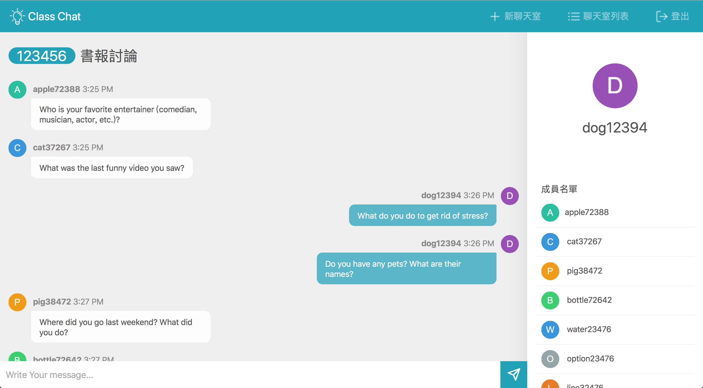

# ClassChat
ClassChat is a multi-room, real-time messaging application built on top of node.js, socket.io. It implements custom session control, allowing users to create, join, and interact with multiple rooms at the same time by simply input an unique pincode. 

## Demo
View a live demo at http://jchat-node.herokuapp.com

## Installation
Clone the repo (`https://github.com/JoyceX99/jchat-node.git`), `cd` into the new directory and `npm install` the dependencies. 

## Usage
Once all the dependencies have been installed, run `npm start` and head to `localhost:3002`. From there, you can join the lobby, create private rooms, forward the links to friends and invite them to join. 
